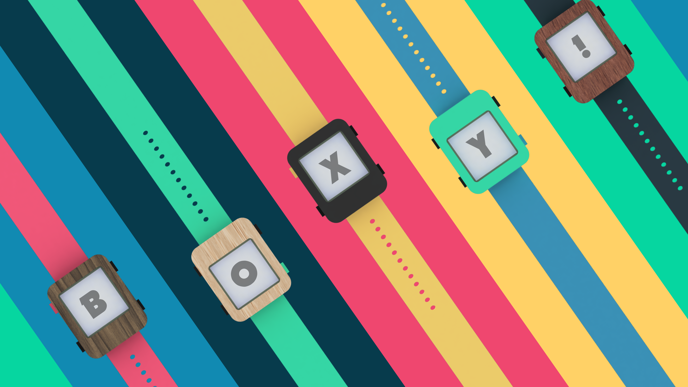
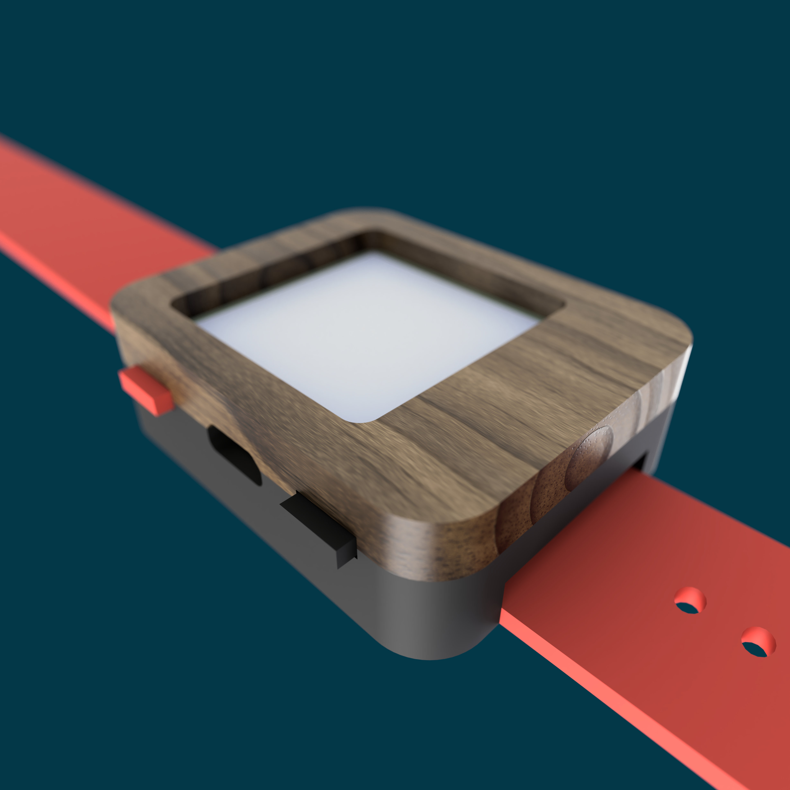

Boxy!
===

By Tythe

Description
---

This is Boxy, it embraces it’s squareness. There are no chamfers or rounded edges to try and hide it’s form, just sharp 90-degree edges and a flashy accent button. Boxy was envisioned with a top that can be easily swapped so you can have a different looking watch for a variety of occasions. Designed to be easily machined on a 3 -axis CNC with only single sided machining. Works with 24mm watch bands.

Photos
---

Files
---

1 x BoxyBottom.stl

1 x BoxyTop.stl

4 x ButtonIndent.stl or 4 x ButtonNoIndent.stl or 4 x ButtonCNC.stl or 4 x ButtonCNCNoIndent.stl

My printer required a bit of an indent to properly have the buttons depress but I included one without the indent for people with better calibrated printers. 3d print the top face down with no supports and the bottom wrist side down with supports. A layer height of 0.175mm produced good results.

The Fusion360 archive includes the tool paths I used for cutting the top out of red oak. I used a 1/4” and 1/8” flat endmills to mill the top and a PCB drill for the hole. The CNC buttons have a little shorter base to accommodate the radius of the 1/8” endmill.

License
---

License:  MIT License
