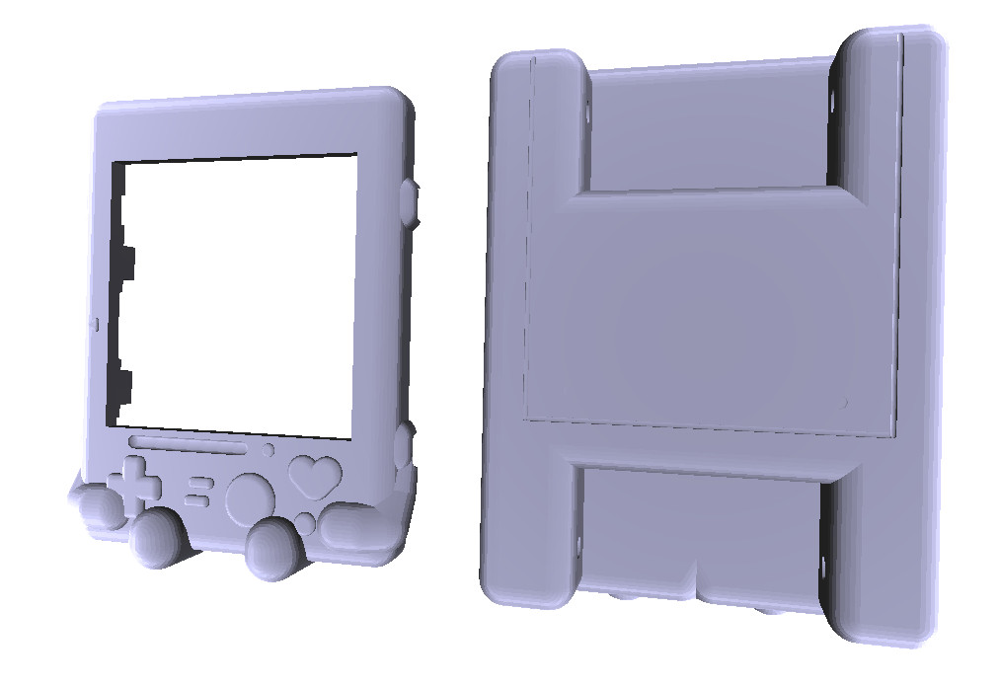

Watch-o Watchy Case
===

| | |
|---|---|
| Name | Watch-o |
| Author | [@abetusk](https://github.com/abetusk) |
| License | [CC0](https://creativecommons.org/share-your-work/public-domain/cc0/) |

| | |
|---|---|
|  |  |

Description
---

A watch face for Watchy inspired by a loveable robot.

**PLEASE NOTE**: This is untested and there might be problems with the top and bottom
shell interfacing and locking with each other, placement of Watchy in the case and
the screen position as well as the holes in the back for the strap posts.
Watch-o should be considered a 'proof of concept' until it can be verified the
realized case works as expected.

License
---

[CC0](https://creativecommons.org/share-your-work/public-domain/cc0/)

