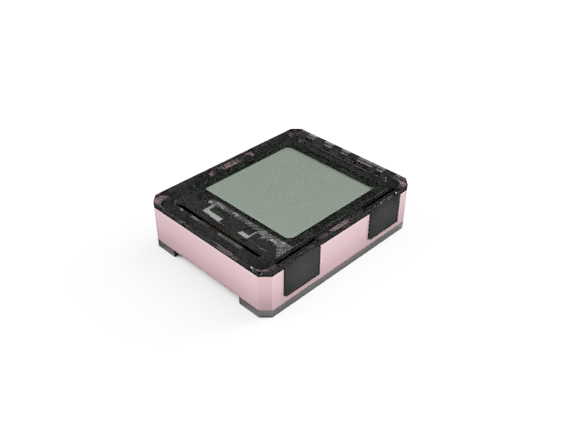

# Zoidy
A case concept for [Watchy](https://www.crowdsupply.com/sqfmi/watchy)

*by Rajendra Serber*

I wanted to give some protection to the display while adding the option to embellish the dial. With this design there is a "glass" that protect the face which allows the print the dial seperatly. You could print tick marks for an analog clock, you could add your favorite artwork, your name, or you could leave out the dial and see the full glory of Watchy underneath the glass.

In thinking about this design I had in mind people who will 3d print or CNC their own case could have fun with mixing and matching colors and materials, and people that get the case from another source could still customize the dial just by printing or drawing the dial on paper.

This incomplete draft is still missing binding pins and screws. It could use some engineering improvements and needs some aesthetic refinement. It's more of a design concept at this point, regardless I hope you find it interesting.

Zoidy © 2021 by Rajendra Serber is licensed under Attribution 4.0 International. Use this for whatever you like, just include an atribution.
